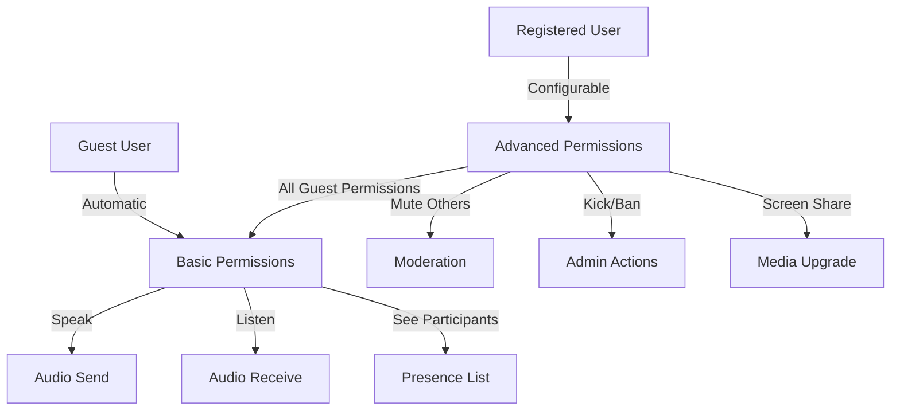
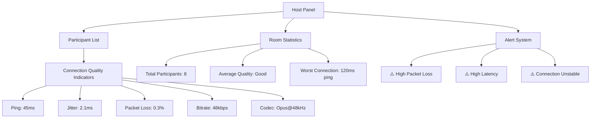
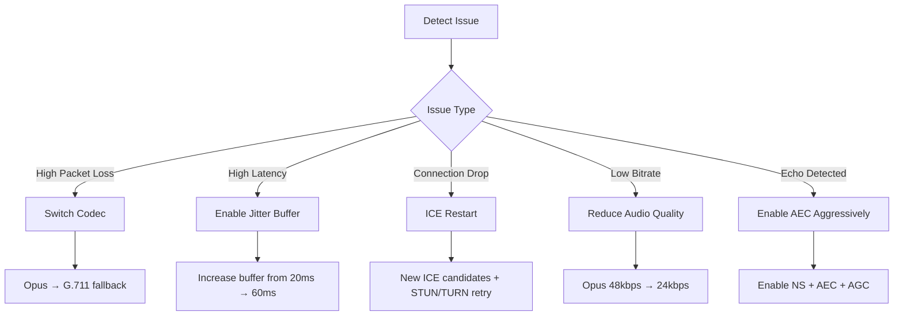
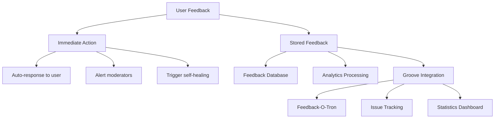

# Burble Design Decisions

<!-- SPDX-License-Identifier: MPL-2.0 -->

This document captures key design decisions for Burble's advanced features including permissions, connection monitoring, self-healing systems, traffic smoothing, and feedback mechanisms.

## Table of Contents

1. [Permission System Design](#permission-system-design)
2. [Connection Monitoring & Host Panel](#connection-monitoring--host-panel)
3. [Self-Healing & Fault Tolerance](#self-healing--fault-tolerance)
4. [Traffic Smoothing & QoS](#traffic-smoothing--qos)
5. [Feedback Systems](#feedback-systems)
6. [Implementation Roadmap](#implementation-roadmap)

## Permission System Design

### Current State Analysis

**"Permission system exists but complex for guests" means:**
- Current system uses capability-based permissions with fine-grained controls
- Guests must navigate the same permission lattice as registered users
- No simplified "guest mode" with reduced permission complexity
- Permission checks happen at multiple layers (room join, media access, admin actions)

### Ideal Permission System Design

#### 1. **Simplified Guest Permissions**

**Design Decision:** Implement a two-tier permission system:



**Implementation:**
- `Burble.Auth.GuestPermissions` module with predefined capabilities
- Automatic assignment of `[:speak, :listen, :see_presence]` to guests
- Optional `guest_promotion` workflow for hosts to elevate guests

#### 2. **Permission Tiers**

| Tier | User Type | Capabilities |
|------|-----------|--------------|
| 0 | Guest | speak, listen, see_presence |
| 1 | Member | +mute_self, +hand_raise, +chat_send |
| 1 | LLM | speak, chat_send (selective) |
| 2 | Moderator | +mute_others, +kick, +see_stats |
| 3 | Admin | +ban, +room_settings, +promote |
| 4 | Owner | +delete_room, +transfer_ownership |

**LLM Permission Design Decision**:
- LLM participants use tier 1 capabilities selectively
- They have `speak` and `chat_send` for programmatic communication
- They lack human-facing controls (`hand_raise`, `mute_self`) as these are UI-driven
- This selective approach prevents capability creep while maintaining necessary functionality

**Code Implementation:**
```elixir
# In lib/burble/auth/permissions.ex
defmodule Burble.Auth.Permissions do
  @guest_capabilities [:speak, :listen, :see_presence]
  @member_capabilities @guest_capabilities ++ [:mute_self, :hand_raise, :chat_send]
  @moderator_capabilities @member_capabilities ++ [:mute_others, :kick, :see_stats]
  @admin_capabilities @moderator_capabilities ++ [:ban, :room_settings, :promote]
  @owner_capabilities @admin_capabilities ++ [:delete_room, :transfer_ownership]
  
  def capabilities_for(:guest), do: @guest_capabilities
  def capabilities_for(:member), do: @member_capabilities
  def capabilities_for(:moderator), do: @moderator_capabilities
  def capabilities_for(:admin), do: @admin_capabilities
  def capabilities_for(:owner), do: @owner_capabilities
end
```

#### 3. **Temporary Permission Elevation**

**Design:** Time-limited permission boosts for specific actions:
- `request_microphone` → temporary `:speak` permission
- `request_screen_share` → temporary `:present` permission
- `request_moderation` → temporary `:mute_others` permission

**Implementation:**
```elixir
defmodule Burble.Rooms.TemporaryPermissions do
  use GenServer
  
  def start_link(room_id, user_id, capabilities, ttl_seconds) do
    GenServer.start_link(__MODULE__, %{room_id: room_id, user_id: user_id, 
                                      capabilities: capabilities, expires_at: naive_datetime_add(System.system_time(:second), ttl_seconds)}, 
                 name: via_tuple(room_id, user_id))
  end
  
  # Auto-revoke when timer expires
  def handle_info(:timeout, state) do
    Burble.Rooms.notify_permission_revoked(state.room_id, state.user_id, state.capabilities)
    {:stop, :normal, state}
  end
end
```

## Connection Monitoring & Host Panel

### Current State
- Basic WebRTC stats collection exists
- No centralized monitoring dashboard
- Individual connection issues visible only to affected users

### Ideal Host Panel Design

#### 1. **Connection Health Dashboard**



#### 2. **Real-time Metrics Collection**

**WebRTC Stats to Monitor:**
- `googRtt` (Round Trip Time)
- `googJitterReceived` (Jitter)
- `packetsLost` (Packet loss)
- `bytesReceived` (Bitrate)
- `googCurrentDelayMs` (End-to-end delay)
- `googDecodeMs` (Decode time)
- `googExpandRate` (Packet expansion)

**Implementation:**
```javascript
// In client/web/src/webrtc_monitor.js
class ConnectionMonitor {
  constructor(peerConnection, userId, onStatsUpdate) {
    this.pc = peerConnection;
    this.userId = userId;
    this.onStatsUpdate = onStatsUpdate;
    this.interval = setInterval(() => this.collectStats(), 1000);
  }
  
  async collectStats() {
    const stats = await this.pc.getStats();
    const result = {};
    
    stats.forEach(report => {
      if (report.type === 'inbound-rtp') {
        result.ping = report.roundTripTime * 1000; // ms
        result.jitter = report.jitter * 1000; // ms
        result.packetLoss = report.packetsLost;
        result.bitrate = report.bytesReceived / (report.timestamp - this.lastTimestamp);
      }
    });
    
    this.onStatsUpdate(this.userId, result);
    this.lastTimestamp = performance.now();
  }
}
```

#### 3. **Quality Scoring System**

```elixir
defmodule Burble.Monitoring.QualityScore do
  def calculate_score(%{
    ping: ping_ms,
    jitter: jitter_ms,
    packet_loss: packet_loss_percent,
    bitrate: bitrate_kbps
  }) do
    # Normalize each metric to 0-100 scale
    ping_score = min(100, max(0, 100 - ping_ms))
    jitter_score = min(100, max(0, 100 - jitter_ms * 10))
    packet_loss_score = min(100, max(0, 100 - packet_loss_percent * 5))
    bitrate_score = min(100, max(0, bitrate_kbps * 2))
    
    # Weighted average
    overall_score = 
      ping_score * 0.4 +
      jitter_score * 0.2 +
      packet_loss_score * 0.3 +
      bitrate_score * 0.1
    
    # Map to quality level
    cond do
      overall_score >= 80 -> :excellent
      overall_score >= 60 -> :good
      overall_score >= 40 -> :fair
      overall_score >= 20 -> :poor
      true -> :bad
    end
  end
end
```

#### 4. **Participant-Side Issue Reporting**

**Design:**
- "🚨 Report Issue" button in client UI
- Pre-defined issue categories:
  - Audio choppy/robotic
  - High latency/delay
  - Echo or feedback
  - No audio from specific person
  - Connection drops
- Automatic attachment of current WebRTC stats

**UI Implementation:**
```html
<div class="issue-reporter">
  <button onclick="showIssueForm()" title="Report connection problem">🚨</button>
  <div id="issue-form" class="hidden">
    <h3>Report Connection Issue</h3>
    <select id="issue-type">
      <option value="choppy">Audio is choppy/robotic</option>
      <option value="latency">High latency/delay</option>
      <option value="echo">Echo or feedback</option>
      <option value="no_audio">Can't hear someone</option>
      <option value="drops">Connection keeps dropping</option>
      <option value="other">Other issue</option>
    </select>
    <textarea id="issue-details" placeholder="Additional details..."></textarea>
    <button onclick="submitIssue()">Submit Report</button>
  </div>
</div>
```

## Self-Healing & Fault Tolerance

### Current State
- Basic WebRTC reconnection logic
- No automated recovery strategies
- Manual refresh required for most issues

### Ideal Self-Healing System

#### 1. **Automatic Recovery Strategies**



#### 2. **Recovery State Machine**

```elixir
defmodule Burble.SelfHealing.StateMachine do
  use GenStateMachine
  
  @states [:normal, :degraded, :recovering, :failed]
  
  def start_link(user_id) do
    GenStateMachine.start_link(__MODULE__, %{user_id: user_id, state: :normal}, [])
  end
  
  def handle_event(:connection_degraded, %{state: :normal} = state) do
    {:next_state, :degraded, %{
      state | 
      recovery_attempts: 0,
      degraded_since: System.system_time(:second)
    }}
  end
  
  def handle_event(:apply_recovery, %{state: :degraded, recovery_attempts: attempts} = state) 
      when attempts < 3 do
    recovery_action = choose_recovery_action(attempts)
    apply_recovery_action(recovery_action)
    
    {:next_state, :recovering, %{
      state | 
      recovery_attempts: attempts + 1,
      current_recovery: recovery_action
    }}
  end
  
  def handle_event(:recovery_successful, %{state: :recovering} = state) do
    {:next_state, :normal, Map.put(state, :state, :normal)}
  end
  
  def handle_event(:recovery_failed, %{state: :recovering, recovery_attempts: 3} = state) do
    {:next_state, :failed, state}
  end
  
  defp choose_recovery_action(0), do: :switch_codec
  defp choose_recovery_action(1), do: :adjust_jitter_buffer
  defp choose_recovery_action(2), do: :ice_restart
  defp choose_recovery_action(_), do: :reduce_quality
end
```

#### 3. **Automatic Fallback Mechanisms**

**Codec Fallback Chain:**
```elixir
@fallback_chain [
  %{name: :opus, bitrate: 48_000, complexity: 10},
  %{name: :opus, bitrate: 24_000, complexity: 8},
  %{name: :g711, bitrate: 64_000, complexity: 1},
  %{name: :g722, bitrate: 48_000, complexity: 1}
]
```

**Implementation:**
```javascript
// In client/web/src/self_healing.js
class SelfHealingManager {
  constructor(peerConnection) {
    this.pc = peerConnection;
    this.currentCodecIndex = 0;
    this.recoveryAttempts = 0;
    this.monitor = new ConnectionMonitor(pc, this.handleDegradation.bind(this));
  }
  
  handleDegradation(stats) {
    if (this.isDegraded(stats)) {
      this.attemptRecovery();
    }
  }
  
  attemptRecovery() {
    const recoveryActions = [
      () => this.switchCodec(),
      () => this.adjustJitterBuffer(),
      () => this.restartICE(),
      () => this.reduceQuality()
    ];
    
    if (this.recoveryAttempts < recoveryActions.length) {
      recoveryActions[this.recoveryAttempts]();
      this.recoveryAttempts++;
    }
  }
  
  switchCodec() {
    const newCodec = CODEC_FALLBACK_CHAIN[this.currentCodecIndex];
    // Re-negotiate with new codec preferences
    this.currentCodecIndex = (this.currentCodecIndex + 1) % CODEC_FALLBACK_CHAIN.length;
  }
}
```

#### 4. **Connection Resilience Features**

| Feature | Implementation | Benefit |
|---------|----------------|---------|
| **ICE Restart** | Generate new ICE candidates | Recovers from network changes |
| **STUN/TURN Fallback** | Try TURN if STUN fails | Works behind symmetric NATs |
| **Packet Retransmission** | NACK-based retransmission | Recovers lost packets |
| **Forward Error Correction** | Reed-Solomon FEC | Mitigates packet loss |
| **Dynamic Jitter Buffer** | Adaptive buffer sizing | Handles network jitter |

## Traffic Smoothing & QoS

### Feasibility Analysis

**Yes, traffic smoothing is possible and recommended.** Here are the approaches:

#### 1. **Jitter Buffer Adaptation**

**Design:**
```c
// In ffi/zig/src/coprocessor/jitter_buffer.zig
pub fn adapt_jitter_buffer(
    buffer: *JitterBuffer,
    current_jitter_ms: f32,
    packet_loss_percent: f32
) void {
    // Target: maintain 2-3x current jitter
    const target_size = current_jitter_ms * (2.0 + packet_loss_percent * 0.1);
    
    // Smooth transition to avoid audio glitches
    const current_size = buffer.get_current_size();
    const step = (target_size - current_size) * 0.1; // 10% adjustment per call
    
    buffer.set_size(current_size + step);
    
    // Enable PLC if packet loss > 5%
    if (packet_loss_percent > 5.0) {
        buffer.enable_plc(true);
    }
}
```

#### 2. **Adaptive Bitrate Control**

**Algorithm:**
```elixir
defmodule Burble.TrafficSmoothing.BitrateController do
  def adjust_bitrate(current_stats) do
    packet_loss = current_stats.packet_loss_percent
    jitter = current_stats.jitter_ms
    
    current_bitrate = current_stats.bitrate_kbps
    
    # Calculate target bitrate based on conditions
    target_bitrate = 
      cond do
        packet_loss > 10 -> current_bitrate * 0.8  # Reduce by 20%
        packet_loss > 5 -> current_bitrate * 0.9   # Reduce by 10%
        jitter > 50 -> current_bitrate * 0.9       # Reduce by 10%
        true -> min(current_bitrate * 1.05, 512)   # Slow increase, max 512kbps
      end
    
    # Apply smoothing to avoid sudden changes
    adjusted = current_bitrate + (target_bitrate - current_bitrate) * 0.2
    
    # Quantize to standard Opus bitrates
    quantize_bitrate(adjusted)
  end
  
  defp quantize_bitrate(bitrate) when bitrate <= 16, do: 16
  defp quantize_bitrate(bitrate) when bitrate <= 24, do: 24
  defp quantize_bitrate(bitrate) when bitrate <= 32, do: 32
  defp quantize_bitrate(bitrate) when bitrate <= 48, do: 48
  defp quantize_bitrate(bitrate) when bitrate <= 64, do: 64
  defp quantize_bitrate(bitrate) when bitrate <= 96, do: 96
  defp quantize_bitrate(bitrate) when bitrate <= 128, do: 128
  defp quantize_bitrate(_), do: 512
end
```

#### 3. **Packet Pacing & Scheduling**

**Implementation:**
```javascript
// In client/web/src/traffic_shaping.js
class PacketPacer {
  constructor(rtpSender, initialBitrate = 48) {
    this.sender = rtpSender;
    this.targetBitrate = initialBitrate;
    this.packetInterval = 20; // ms between packets
    this.queue = [];
    this.timer = null;
  }
  
  setBitrate(kbps) {
    this.targetBitrate = kbps;
    // Calculate packet interval based on bitrate
    // Opus @ 48kbps = 120 bytes/packet → 6kbps per 20ms packet
    this.packetInterval = (120 * 8 * 1000) / (kbps * 1000);
    this.restartTimer();
  }
  
  enqueue(packet) {
    this.queue.push(packet);
    if (!this.timer) this.startTimer();
  }
  
  startTimer() {
    this.timer = setInterval(() => {
      if (this.queue.length > 0) {
        const packet = this.queue.shift();
        this.sender.send(packet);
      }
    }, this.packetInterval);
  }
}
```

#### 4. **Traffic Shaping Strategies**

| Strategy | Implementation | When to Use |
|-----------|----------------|--------------|
| **Constant Bitrate** | Fixed packet interval | Stable connections |
| **Variable Bitrate** | Dynamic packet spacing | Fluctuating networks |
| **Burst Mitigation** | Packet queuing + pacing | High-jitter networks |
| **Priority Queuing** | Prioritize key frames | Video + audio mix |
| **Forward Error Correction** | Add redundant packets | High packet loss |

## Feedback Systems

### Current State
- No structured feedback system
- Issues reported via GitHub or informal channels
- No in-app feedback mechanism

### Ideal Feedback System Design

#### 1. **Multi-Level Feedback Architecture**



#### 2. **Feedback Collection Points**

**In-App Feedback Types:**

| Type | Collection Point | Data Collected |
|------|------------------|----------------|
| **Connection Issue** | 🚨 button in UI | WebRTC stats, user description |
| **Audio Quality** | Thumbs up/down | Codec, bitrate, quality score |
| **Feature Request** | Feedback form | User suggestion, priority |
| **Bug Report** | Detailed form | Steps, screenshots, logs |
| **Session Rating** | Post-call popup | 1-5 stars + comments |

**Implementation:**
```elixir
defmodule Burble.Feedback do
  @feedback_types [
    :connection_issue,
    :audio_quality,
    :feature_request,
    :bug_report,
    :session_rating
  ]
  
  def submit_feedback(%{
    type: type,
    user_id: user_id,
    room_id: room_id,
    metadata: metadata,
    description: description
  }) when type in @feedback_types do
    # Store in database
    %Feedback{}
    |> Feedback.changeset(%{
      type: type,
      user_id: user_id,
      room_id: room_id,
      metadata: metadata,
      description: description,
      submitted_at: NaiveDateTime.utc_now()
    })
    |> Repo.insert!()
    
    # Send to Groove if configured
    if Application.get_env(:burble, :groove_integration) do
      GrooveClient.submit_feedback(%{
        type: type,
        severity: severity_for(type),
        details: description,
        context: metadata
      })
    end
    
    # Trigger immediate actions based on feedback type
    handle_immediate_actions(type, user_id, room_id, metadata)
    
    :ok
  end
  
  defp severity_for(:connection_issue), do: :high
  defp severity_for(:bug_report), do: :medium
  defp severity_for(:audio_quality), do: :low
  defp severity_for(:feature_request), do: :low
  defp severity_for(:session_rating), do: :info
  
  defp handle_immediate_actions(:connection_issue, user_id, room_id, metadata) do
    # Alert room moderators
    Burble.Rooms.notify_moderators(room_id, :connection_issue, user_id, metadata)
    
    # Trigger self-healing for this user
    Burble.SelfHealing.trigger_for_user(user_id, metadata)
  end
  
  defp handle_immediate_actions(:audio_quality, user_id, room_id, %{"quality_score" => score}) 
      when score <= 2 do
    # Low quality score - alert moderators
    Burble.Rooms.notify_moderators(room_id, :low_audio_quality, user_id, %{
      message: "User reporting poor audio quality (score: #{score})"
    })
  end
  
  defp handle_immediate_actions(_, _, _, _), do: :ok
end
```

#### 3. **Feedback-O-Tron Integration**

**Design:**
```elixir
defmodule Burble.FeedbackOTron do
  @moduledoc """
  Integration with Feedback-O-Tron for advanced feedback processing.
  
  Features:
  - Automatic categorization
  - Sentiment analysis
  - Priority scoring
  - Groove interface for issue tracking
  """
  
  def process_feedback(feedback_id) do
    feedback = Repo.get!(Feedback, feedback_id)
    
    # Analyze and categorize
    analysis = analyze_feedback(feedback)
    
    # Create Groove ticket if needed
    if analysis.priority >= :medium do
      create_groove_ticket(feedback, analysis)
    end
    
    # Update feedback with analysis
    feedback
    |> Feedback.analysis_changeset(analysis)
    |> Repo.update!()
    
    :ok
  end
  
  defp analyze_feedback(%Feedback{
    type: type,
    description: description
  }) do
    sentiment = analyze_sentiment(description)
    category = categorize_feedback(type, description)
    priority = calculate_priority(type, sentiment)
    
    %{
      sentiment: sentiment,
      category: category,
      priority: priority,
      action_recommended: action_for(category, priority)
    }
  end
  
  defp create_groove_ticket(feedback, analysis) do
    # Use Groove HTTP API or direct integration
    post_data = %{
      title: "Feedback: #{feedback.type}",
      description: feedback.description,
      priority: priority_to_groove(analysis.priority),
      metadata: %{
        user_id: feedback.user_id,
        room_id: feedback.room_id,
        burble_feedback_id: feedback.id,
        sentiment: analysis.sentiment,
        category: analysis.category
      }
    }
    
    HTTPoison.post(
      Application.get_env(:burble, :groove_api_url) <> "/tickets",
      Jason.encode!(post_data),
      [{"Content-Type", "application/json"}, {"Authorization", "Bearer " <> groove_api_key()}]
    )
  end
end
```

#### 4. **Real-time Feedback Dashboard**

**Host Panel Integration:**
```javascript
// In client/web/src/host_dashboard.js
class FeedbackDashboard extends HTMLElement {
  constructor() {
    super();
    this.attachShadow({ mode: 'open' });
    this.feedbackItems = [];
  }
  
  connectedCallback() {
    this.render();
    this.setupWebSocket();
  }
  
  setupWebSocket() {
    this.ws = new WebSocket(`/ws/feedback?room=${currentRoomId}`);
    
    this.ws.onmessage = (event) => {
      const feedback = JSON.parse(event.data);
      this.addFeedbackItem(feedback);
    };
  }
  
  addFeedbackItem(feedback) {
    this.feedbackItems.unshift(feedback);
    if (this.feedbackItems.length > 50) this.feedbackItems.pop();
    this.render();
    
    // Highlight important feedback
    if (feedback.priority >= 'medium') {
      this.highlightImportant(feedback);
    }
  }
  
  highlightImportant(feedback) {
    // Visual notification for host
    const notification = document.createElement('div');
    notification.className = 'feedback-alert';
    notification.textContent = `⚠️ ${feedback.type}: ${feedback.summary}`;
    document.body.appendChild(notification);
    
    setTimeout(() => notification.remove(), 10000);
  }
  
  render() {
    this.shadowRoot.innerHTML = `
      <style>
        .dashboard { font-family: sans-serif; }
        .feedback-item { padding: 8px; border-bottom: 1px solid #eee; }
        .feedback-item.high { background: #fff8e1; }
        .feedback-item.critical { background: #ffebee; }
      </style>
      <div class="dashboard">
        <h3>Recent Feedback (${this.feedbackItems.length})</h3>
        ${this.feedbackItems.map(item => `
          <div class="feedback-item ${this.priorityClass(item.priority)}">
            <strong>${item.type}</strong>: ${item.summary}
            <small>${new Date(item.timestamp).toLocaleTimeString()}</small>
          </div>
        `).join('')}
      </div>
    `;
  }
  
  priorityClass(priority) {
    return priority >= 'high' ? 'critical' : priority >= 'medium' ? 'high' : '';
  }
}

customElements.define('feedback-dashboard', FeedbackDashboard);
```

## Implementation Roadmap

### Phase 1: Foundation (2-4 weeks)
- [ ] Implement simplified permission system
- [ ] Add basic connection monitoring to host panel
- [ ] Create self-healing state machine
- [ ] Implement jitter buffer adaptation
- [ ] Add in-app feedback button

### Phase 2: Enhancement (3-5 weeks)
- [ ] Complete host dashboard with all metrics
- [ ] Add participant-side issue reporting
- [ ] Implement codec fallback system
- [ ] Add adaptive bitrate control
- [ ] Integrate with Feedback-O-Tron

### Phase 3: Polish (2-3 weeks)
- [ ] Add visual alerts for connection issues
- [ ] Implement automatic recovery strategies
- [ ] Add traffic smoothing options
- [ ] Create analytics dashboard
- [ ] Document all features

### Phase 4: Testing & Optimization (2 weeks)
- [ ] Load testing with simulated network conditions
- [ ] User testing for feedback mechanisms
- [ ] Performance optimization
- [ ] Security audit

## Technical Feasibility Assessment

| Feature | Feasibility | Complexity | Dependencies |
|---------|--------------|------------|--------------|
| **Simplified Permissions** | ✅ High | Medium | None |
| **Host Connection Monitor** | ✅ High | High | WebRTC stats API |
| **Self-Healing System** | ✅ Medium | High | State management |
| **Traffic Smoothing** | ✅ High | Medium | Jitter buffer control |
| **Feedback-O-Tron Integration** | ✅ High | Low | Groove API access |
| **Real-time Issue Reporting** | ✅ High | Medium | WebSocket channel |
| **Adaptive Bitrate** | ✅ Medium | High | Codec negotiation |
| **Automatic Recovery** | ⚠️ Medium | Very High | Extensive testing |

## Recommendations

1. **Start with Phase 1** - Build the foundation first
2. **Prioritize monitoring** - You can't fix what you can't see
3. **Implement gradual self-healing** - Start with simple recoveries
4. **Use existing infrastructure** - Leverage Groove/Feedback-O-Tron
5. **Focus on UX** - Make issue reporting intuitive
6. **Test extensively** - Network conditions vary widely
7. **Document everything** - Complex systems need good docs

## Open Questions

1. Should guest users have access to the full feedback system?
2. What's the threshold for automatic vs manual recovery attempts?
3. How should we handle false positives in issue detection?
4. What's the retention policy for feedback data?
5. Should we implement rate limiting on feedback submission?

This design provides a comprehensive roadmap for implementing all the requested features while maintaining security, usability, and technical feasibility.