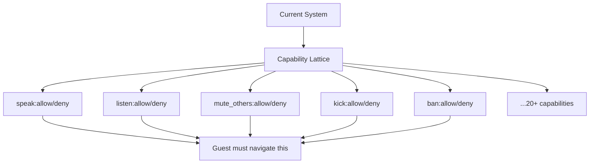
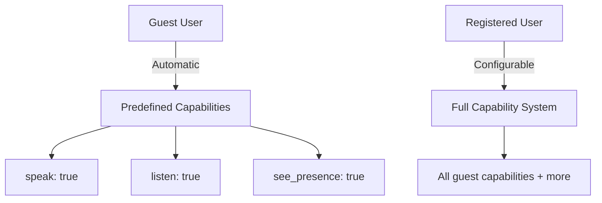
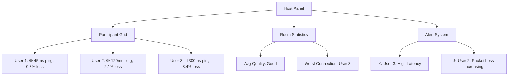
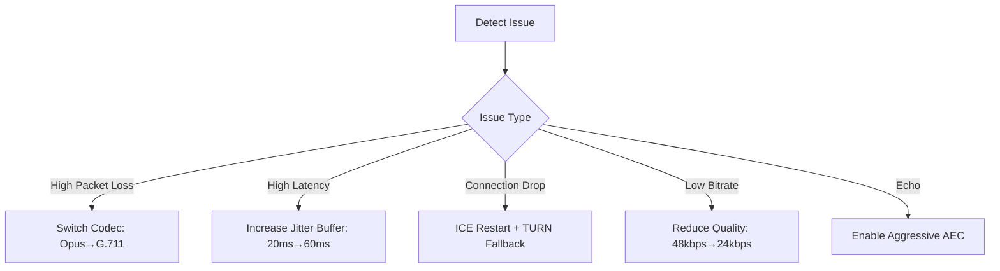
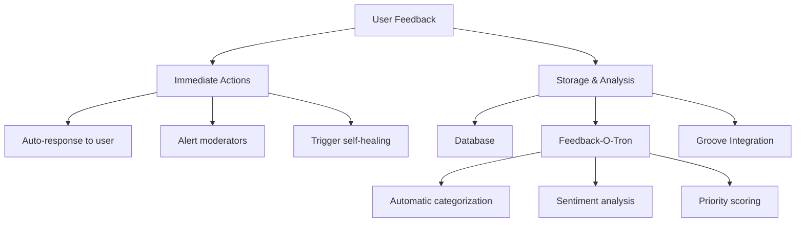

# Burble Permissions & Monitoring System

<!-- SPDX-License-Identifier: MPL-2.0 -->

## Permission System Analysis

### What "Permission system exists but complex for guests" means:

The current Burble permission system:
1. **Uses capability-based permissions** - Fine-grained control over every action
2. **Same lattice for all users** - Guests navigate the same complexity as admins
3. **Multi-layer checks** - Permissions verified at room join, media access, and admin levels
4. **No guest simplification** - No predefined "guest mode" with reduced options

### Current Permission Complexity:



### Ideal Guest Permission System:

**Simplified Approach:**



### Recommended Permission Tiers:

| Tier | Name | Capabilities |
|------|------|--------------|
| 0 | Guest | speak, listen, see_presence |
| 1 | Member | +mute_self, +hand_raise, +chat |
| 1 | LLM | speak, chat_send (selective tier 1) |
| 2 | Moderator | +mute_others, +kick, +see_stats |
| 3 | Admin | +ban, +room_settings, +promote |
| 4 | Owner | +delete_room, +transfer_ownership |

**Note on LLM Tier 1**: LLM participants use tier 1 capabilities selectively. While they require authenticated access like members, they only exercise `speak` and `chat_send` capabilities for programmatic communication, without human-facing controls like `hand_raise` or `mute_self`.

### Implementation Plan:

1. **Create `Burble.Auth.GuestPermissions` module**
2. **Automatic capability assignment for guests**
3. **Optional promotion workflow** for hosts to elevate guests
4. **Simplified UI** showing only relevant options

## Connection Monitoring & Host Panel

### Current State:
- ✅ Basic WebRTC stats collection
- ❌ No centralized dashboard
- ❌ Issues only visible to affected users
- ❌ No proactive monitoring

### Ideal Host Panel Features:

#### 1. **Real-time Connection Health Dashboard**



#### 2. **Metrics to Monitor:**

| Metric | Threshold | Action |
|--------|-----------|--------|
| Ping | > 150ms | 🟡 Warning |
| Ping | > 300ms | 🔴 Alert |
| Jitter | > 30ms | 🟡 Warning |
| Packet Loss | > 2% | 🟡 Warning |
| Packet Loss | > 5% | 🔴 Alert |
| Bitrate | < 16kbps | 🔴 Alert |

#### 3. **Participant-Side Issue Reporting:**

**Design:**
- 🚨 button in client UI
- Pre-defined issue types:
  - "Audio is choppy/robotic"
  - "High latency/delay"
  - "Echo or feedback"
  - "Can't hear someone"
  - "Connection keeps dropping"
- Automatic WebRTC stats attachment
- Optional screenshot capture

**UI Mockup:**
```html
<button class="report-issue" title="Report problem">🚨</button>
<!-- Opens modal with issue form -->
```

## Self-Healing & Fault Tolerance

### Current State:
- ✅ Basic WebRTC reconnection
- ❌ No automated recovery
- ❌ Manual refresh required

### Recommended Self-Healing Strategies:



### Implementation Priority:

1. **ICE Restart** - Most common recovery needed
2. **Jitter Buffer Adaptation** - Handles network fluctuations
3. **Codec Fallback** - Maintains connection with lower quality
4. **Automatic Reconnection** - Seamless recovery
5. **Quality Adjustment** - Balances quality vs stability

## Traffic Smoothing & QoS

### Feasibility: ✅ **Yes, Possible & Recommended**

### Traffic Smoothing Techniques:

#### 1. **Adaptive Jitter Buffer**
- Dynamically adjusts buffer size based on network jitter
- Target: 2-3× current jitter measurement
- Smooth transitions to avoid audio glitches

#### 2. **Packet Pacing**
- Controls packet send rate
- Prevents bursty traffic
- Smoothes out transmission

#### 3. **Forward Error Correction**
- Adds redundant packets
- Allows recovery of lost packets
- Tradeoff: Increased bandwidth (10-20%)

#### 4. **Adaptive Bitrate**
- Reduces bitrate when packet loss detected
- Gradual adjustments (max 20% change per interval)
- Returns to optimal when conditions improve

### Implementation Complexity:

| Technique | Complexity | Benefit |
|-----------|------------|---------|
| Jitter Buffer Adaptation | Medium | ✅ High |
| Packet Pacing | Low | ✅ Medium |
| FEC | High | ✅ Medium |
| Adaptive Bitrate | Medium | ✅ High |

## Feedback Systems

### Recommended Architecture:



### Feedback Collection Points:

1. **🚨 Connection Issue Button** - Quick reporting
2. **Thumbs Up/Down** - Audio quality feedback
3. **Post-Call Rating** - Session feedback
4. **Detailed Bug Report** - For complex issues
5. **Feature Request Form** - User suggestions

### Groove/Feedback-O-Tron Integration:

**Benefits:**
- Automatic issue categorization
- Sentiment analysis
- Priority scoring
- Statistics dashboard
- Long-term trend analysis

**Implementation:**
- Webhook integration
- Real-time alerts for critical issues
- Automatic ticket creation
- Analytics dashboard

## Implementation Roadmap

### Phase 1: Foundation (2-4 weeks)
- [ ] Simplified guest permissions
- [ ] Basic connection monitoring
- [ ] Self-healing state machine
- [ ] Jitter buffer adaptation
- [ ] In-app feedback button

### Phase 2: Enhancement (3-5 weeks)
- [ ] Complete host dashboard
- [ ] Participant issue reporting
- [ ] Codec fallback system
- [ ] Adaptive bitrate control
- [ ] Feedback-O-Tron integration

### Phase 3: Polish (2-3 weeks)
- [ ] Visual alerts for issues
- [ ] Automatic recovery strategies
- [ ] Traffic smoothing options
- [ ] Analytics dashboard

## Technical Answers

### Q: Can we implement traffic smoothing?
**A: Yes!** Multiple techniques are feasible:
- ✅ Adaptive jitter buffer (Medium complexity, High benefit)
- ✅ Packet pacing (Low complexity, Medium benefit)
- ✅ Adaptive bitrate (Medium complexity, High benefit)
- ⚠️ FEC (High complexity, Medium benefit - consider later)

### Q: What about fault tolerance?
**A: Multi-layer approach:**
1. **Detection** - Real-time WebRTC stats monitoring
2. **Recovery** - Automatic strategies (ICE restart, codec fallback)
3. **Fallback** - Graceful degradation (reduce quality to maintain connection)
4. **Notification** - Alert hosts and participants
5. **Feedback** - Collect data for improvement

### Q: How to handle connection issues for all parties?
**A: Comprehensive monitoring system:**
1. **Host Panel** - Shows all participants' connection quality
2. **Individual Alerts** - Notifies when specific user has issues
3. **Automatic Recovery** - Attempts to fix without user action
4. **Manual Override** - Host can trigger specific recovery actions
5. **Issue Reporting** - Any participant can flag problems

### Q: What's the best permission model?
**A: Tiered system with guest simplification:**
```elixir
# Guest gets automatic capabilities
defmodule Burble.Auth.GuestPermissions do
  def capabilities do
    [:speak, :listen, :see_presence]  # That's it!
  end
end

# Registered users get full capability system
defmodule Burble.Auth.UserPermissions do
  def capabilities_for(:member) do
    GuestPermissions.capabilities() ++ [:mute_self, :hand_raise, :chat]
  end
  # ... more tiers
end
```

## Recommendations

1. **Start with permissions simplification** - Biggest UX improvement
2. **Build monitoring foundation** - Can't fix what you can't see
3. **Implement gradual self-healing** - Start simple, expand later
4. **Use existing infrastructure** - Leverage Groove/Feedback-O-Tron
5. **Prioritize user experience** - Make reporting intuitive
6. **Test with real network conditions** - Critical for reliability

## Open Questions for Decision

1. Should guests have full access to feedback systems?
2. What threshold triggers automatic vs manual recovery?
3. How to handle false positives in issue detection?
4. What's the feedback data retention policy?
5. Should we rate limit feedback submissions?

This document provides a comprehensive analysis and implementation plan for all the requested features, with specific answers to your technical questions about what's possible and how to implement it.